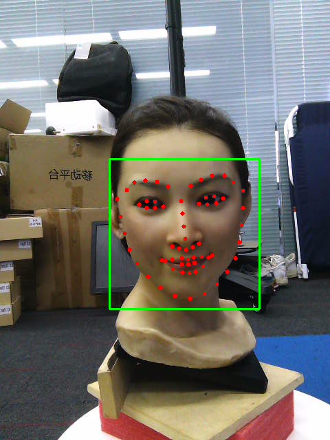

# Dlib(人脸检测库)

[](https://travis-ci.org/joemccann/dillinger)

#### 对Dlib人脸检测库做的测试Demo，主要包含<u>人脸框检测</u>和<u>人脸68个关键点检测</u>两部分。 

**输入**：一张人脸图 demo_img.png

**输出**：带有标注出人脸框和68个关键点的图片

**依赖库**：OpenCV，Dlib

# How to run
```
 mkdir ./build
 cd build
 cmake .. -G "Visual Studio 15 2017 Win64"    (Winddows VS 2017)
```

## Results


